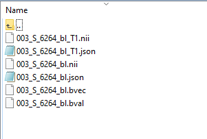
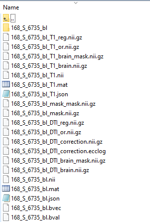
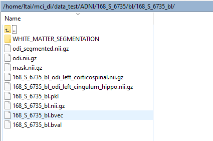
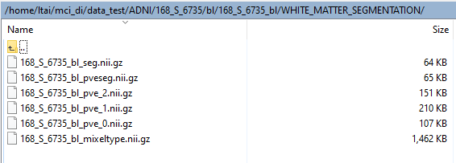

# Matthew Thesis
This repository contain code that extended from Matthew Jone's THESIS(https://github.com/plyte/THESIS).

This contains pipline for preprocessing structural MRI and DTI images and running NODDI analysis. This pipline is optimized using T1 and DTI images downloaded from the Alzheimer's Disease Neuroimaging Initiative (ADNI) database.

# Requirements 
CentOs Linux 7.7.1908 (Core)
python 3.7.x
conda 4.6.8
pip

dmipy (python package)
https://github.com/AthenaEPI/dmipy.git

# other python package:
numpy(1.17.3 <= for dmipy to work)
dipy
pathos
numba
pandas
matplotlib
fury
dill
dicom2nifti
dcm2niix (installed using conda)

# git repos:
diffusion_imaging
https://github.com/lytai1/difusion_imaging.git

# Setup
1. clone this repo, diffusion_imaging and dmipy repos
2. create conda environment (dmipy is the name of the environment used in this readme file)
      conda create --name dmipy python==3.7
      ==> y to proceed
      conda init
      conda activate dmipy
3. install all python packages. Make sure the numpy installed is in version 1.17.3
`pip install numpy==1.17.3 pandas matplotlib dipy pathos numba fury dill`
4. install fsl
  1. download fslinstaller.py in https://fsl.fmrib.ox.ac.uk/fsldownloads_registration
  2. python fslinstaller.py (make sure it is in python 2.x environment. do conda deactivate to run in base environment)
  3. select the right directory for the fsl folder
5. install dmipy package (need numpy==1.15.4 for windows to work)
`cd dmipy`
`python setup.py install`
6. install diffusion_imaging package
`cd diffusion_imaging`
`python setup.py install`
7. install dicom2nifti python package
`pip install dicom2nifti`
8. install dcm2niix
`conda install -c conda-forge dcm2niix`
(make sure it is in the "dmipy" conda environment)
** restart after fsl and dmipy package installation

# ADNI database access
1) go to http://adni.loni.usc.edu/
2) go to the "data & sample" tab, click "access data and samples"
3) click on login in the middle of the page
4) log in or create account using the box in the right upper corner (new accounts need to be approved by the ADNI manager. It usually takes 1-2 days for the new accout to be approved)
5) Click on the search tab, click "Advance Image Search(beta)"
6) We can search for images using the search page. In this project, the setting we used are as follow:
Phase: ADNI3
Research Group: MCI (for MCI patients) or CN (for control)
image: select both "DTI", "MRI" and "and"
7) hit "search" 
8) select the patients with "Accelerated Sgital MPRAGE" and "Axial DTI"
9) click one click download

# To convert DCM files to NIFTI format
** run `conda activate dmipy` first
1) make sure dicom2nifti and dcm2niix is installed in conda environment
`pip install dicom2nifti`
conda install -c conda-forge dcm2niix
2) `cd ~/Matthew_Thesis/Code/NODDI/utilities`
3) run the following command
`python format_files.py --path ~/ADNI/`
4) new folders bl and m12 will be found in the directory instead of the orignial files

example of the directory:

# To run NODDI analysis for one patient
** run `conda activate dmipy` first
1) cd ~/Matthew_Thesis/Code/NODDI/
2) run the following command
`bash run_analysis.sh -d ~t/ADNI -f ~/fsl -p 032_S_6602 -v bl`
3) all jobs can be found in the /past_runs directory

example of the directory after NODDI analysis:

# To run NODDI analysis for multiple patients
** run `conda activate dmipy` first
1) cd ~/Matthew_Thesis/Code/NODDI/
2) store list of patient id and viscode in csv file e.g. adni3_test_list.csv
3) modify the `ADNI_DIR`, `INPUT_PATIENT_LIST` and `FSL_DIR` in the `run_analysis_multiple.sh` accordingly
4) `bash run_analysis_multiple.sh`
5) all jobs can be found in the /past_runs directory

# To apply JHU mask tracts and extract ODI for multiple patients
** run `conda activate dmipy` first, make sure NODDI analysis is done
1) cd ~/Matthew_Thesis/Code/NODDI/
2) store list of patient id and viscode in csv file e.g. adni3_test_list.csv
3) store list of volume number(4 digits) and name of mask track in csv file e.g. jhu_mask_list.csv
4) modify the `ADNI_DIR`, `INPUT_PATIENT_LIST`, `INPUT_JHU_LIST` and `FSL_DIR` in the `run_analysis_multiple.sh` accordingly
5) run command
`bash run_mask_multiple.sh`

# To extract average ODI values and insert into a csv file
** run `conda activate dmipy` first, make sure NODDI analysis is done and applied mask tracts
1) cd ~/Matthew_Thesis/Code/NODDI/
2) store list of patient id and viscode in csv file e.g. adni3_test_list.csv
3) store list of volume number(4 digits) and name of mask track in csv file e.g. jhu_mask_list.csv
4) modify the `ADNI_DIR`, `INPUT_PATIENT_LIST`, and `INPUT_JHU_LIST` in the `insert_stats_multiple.sh` accordingly
5) run command
`bash insert_stats_multiple.sh`
