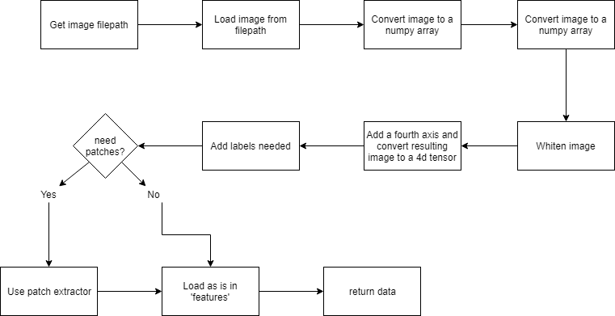
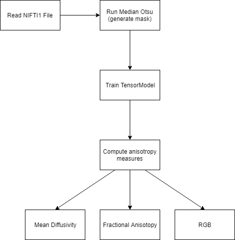

# Thesis
This repository contains work related to the completion of my Masters thesis.

# Topic
The topic of my thesis is `Predicting Congnitive Imparements using Magnetic Resonance Imaging`

# Resources/References
This section contains possible useful information going forward that includes articles and library links.

DLTK: https://dltk.github.io/
Reading medical imagines in tensorflow. Done using the .nii format. 

The process is depicted below:

NIFTI-1: https://nifti.nimh.nih.gov/nifti-1/
The image format used

DIPY - Diffusion Tensor Imaging:
Read the scan into python and compute the diffusivity, mean anisotropy and RGB of the data

The process is depicted below:
